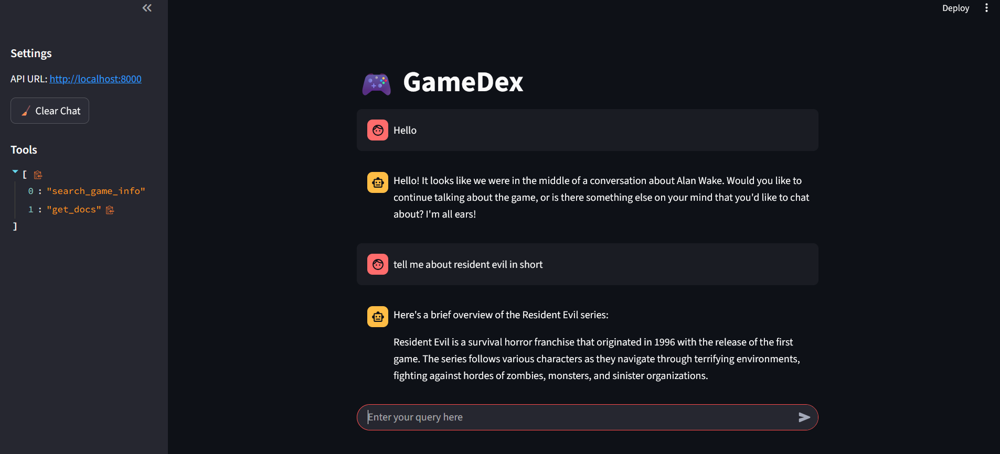

# 🎮 GameDex

GameDex is an intelligent assistant focused on providing information about **video games** using a combination of tools, LLM routing, and a RAG system powered by **Steam dataset + Pinecone**. It features a Streamlit-based frontend and a Python backend using the **Model Context Protocol (MCP)**.

---

## 🔧 Features

- 🎮 Ask about any game (e.g., "Tell me about God of War")
- 🤖 Smart classification with Groq’s LLaMA3-70B (via `groq` SDK)
- 🛠️ Tools executed using MCP protocol
- 🔍 Game info powered by Pinecone-based RAG from Steam dataset
- 🖥️ Clean and interactive Streamlit UI
- 🧠 Fallback to LLM when no relevant data found

---

## 🖼️ Preview

<p align="center">
  
</p>

---

## 🏗️ Architecture

- **Frontend**: Streamlit app (`app.py`)
- **Backend**: Python-based MCP client and tools
- **LLM**: Groq’s LLaMA3-70B
- **RAG**: Steam dataset → vectorized using `sentence-transformers` → stored in Pinecone
- **Tooling**: Game-related tools implemented via MCP

---

## 📚 RAG: Game Info

The Retrieval-Augmented Generation (RAG) system in GameDex is built specifically for **video games**.

**Pipeline:**

1. Downloaded **Steam dataset** from Kaggle.
2. Selected and cleaned relevant fields like title, description, genre, etc.
3. Embedded using **sentence-transformers**.
4. Stored vectors in **Pinecone** index.
5. On query, MCP tool searches Pinecone for the best-matching game info.
6. Returns result, which is optionally refined by the LLM.

---

## 🚀 Getting Started

### 1. Clone the Repository

```bash
git clone https://github.com/yourusername/gamedex.git
cd gamedex
```

### 2.Create Virtual Environment
```bash
python -m venv .venv
source .venv/bin/activate  # On Windows: .venv\Scripts\activate
```

### 3.Install Dependencies
```bash
pip install -r requirements.txt
```

### 4.Configure Environment Variables
```bash
GROQ_API_KEY=your_groq_api_key
PINECONE_API_KEY=your_pinecone_key
PINECONE_ENVIRONMENT=your_pinecone_env
PINECONE_INDEX_NAME=your_index_name
```

## ▶️ Run the App

### 1.Start MCP Client
```bash
cd api
uvicorn main:app
```

### 2.Start the Streamlit UI
```bash
streamlit run frontend/main.py
```
